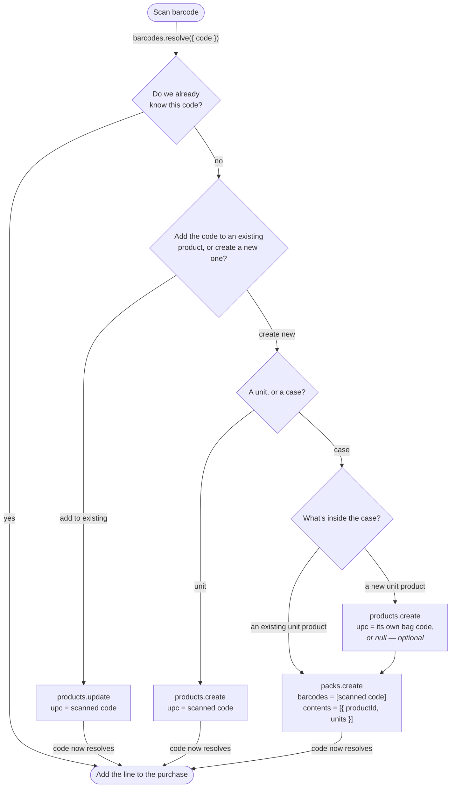

# Log Purchase — barcode flow

Followed from the barcode's point of view: every path ends with the scanned
code attached to exactly one record, and all of them rejoin the same "add a
line" flow.

> **Status.** Built today: the case branch's *pick a unit product or create
> one* step. Proposed: *add the code to an existing product* on the unit
> branch, and the *optional own barcode* on a newly created unit product
> (`BarcodeSetupPanel` currently hardcodes `upc: null` there). Both are UI-only
> — `products.update` and `products.create` already validate, normalize, and
> uniqueness-check a `upc`.

Code: [`BarcodeResolverServiceImpl`](../../packages/api/src/services/BarcodeResolverService/BarcodeResolverServiceImpl.ts)
· [`BarcodeSetupPanel`](../../packages/web/src/components/BarcodeSetupPanel.tsx)
· [`ProductServiceImpl.validate`](../../packages/api/src/services/ProductService/ProductServiceImpl.ts)

## Where the scanned code ends up

The branches differ only in **which record owns the scanned code** — that is
the whole decision:

| Branch | Owner of the scanned code | Next scan resolves as |
|---|---|---|
| already known | an existing product or pack | `product` / `pack` |
| add to existing | that product's `upc` | `product` |
| create new → unit | the new product's `upc` | `product` |
| create new → case | the pack's `barcodes[]` | `pack` |

## The case branch has two different codes

This is the easy one to get wrong. In the case branch the scanned code is the
**case** code and belongs to the pack. The inner unit product's barcode is a
*different* code — the one printed on the single bag — and it is optional,
because you usually have the case in your hands and not the bag.

- Scanned case code → `pack.barcodes[]`, always.
- Inner product's own bag code → `product.upc`, only if you happen to have it.
- Leave it null and nothing breaks: the next time you scan an actual bag, that
  code resolves as `unknown` and the *add to existing* branch attaches it to
  this same product.

A code can only ever be owned once. `validate()` rejects a `upc` already on
another product **and** one already used as a pack's case barcode, so the same
digits can never mean both a can and a case.

## Why "add to existing" matters

Products imported from a CSV arrive with `upc = null`, as do inner unit
products created without their bag code. Without this branch, the first scan of
such an item forces a duplicate product — one holding the barcode, one holding
the history. The branch is what lets a scan *enrich* the catalog instead of
forking it.
