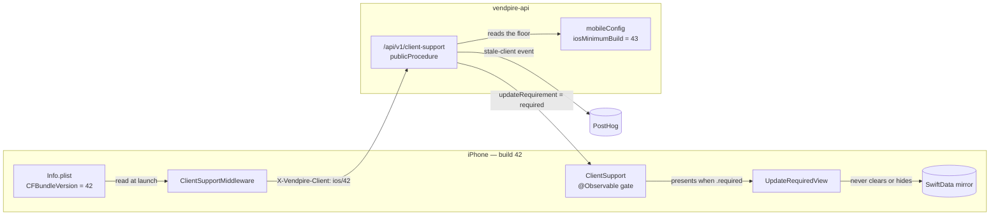
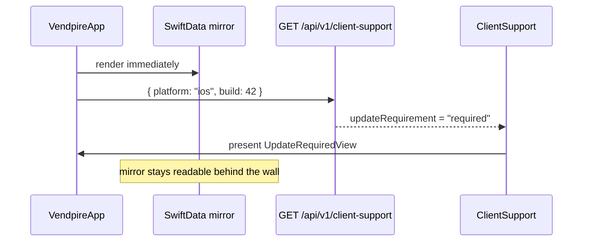
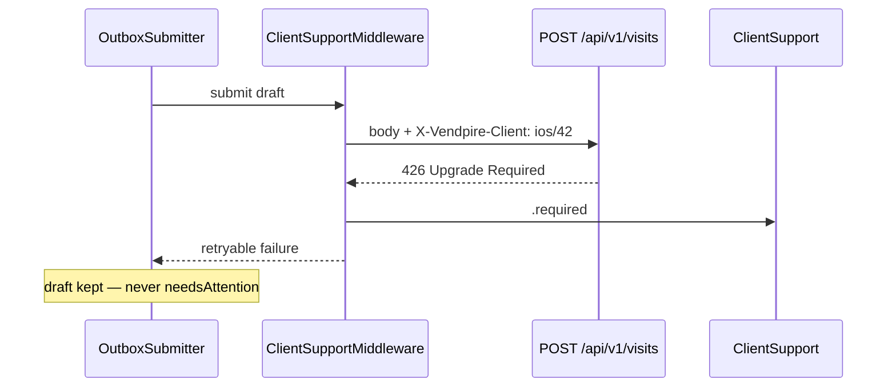
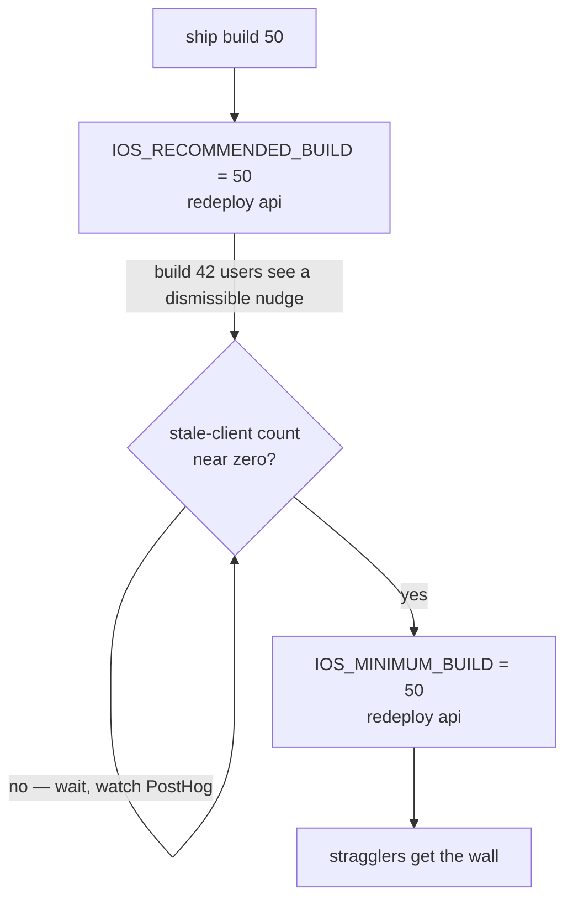

# Forced update

How a Vendpire iOS build that we no longer support gets told to upgrade, and
how the floor that decides "no longer supported" gets raised without stranding
anyone.

> **Status: planned, not built.** Nothing in this file exists in code yet. It is
> specified across Phases 2, 6, 7 and 8 of
> `docs/plans/2026-10-05-visits-and-ios.md` — this file is the one place the
> whole mechanism is told as a single story. Every file path below is a
> destination, not a location.

## Why this is documented before it is built

**A build that doesn't know how to be told it's too old can never be told.**

The floor is server-side policy, so raising it reaches back to a binary
compiled months ago — but only if that binary already shipped the machinery to
listen. There is no retrofit: the users who need the message are exactly the
ones who don't install updates. So the client half lands in the Phase 2
scaffold and sits inert behind a floor of `0`, and the policy half stays a dial
we turn later.

That asymmetry is the entire design rationale. Everything below follows from it.

## The two numbers

These are easy to confuse, and confusing them is how the feature gets built
backwards.

| | Lives in | Is | Set by |
|---|---|---|---|
| The app's own build | `CFBundleVersion`, the app's `Info.plist` | a fact about this binary | Xcode, at build time |
| The floor | `IOS_MINIMUM_BUILD`, env var on the **api** | policy: builds below this are unsupported | us, on the deployed api |

The app reports the first and obeys a verdict. **It never learns the floor.**
If the floor lived in the app, changing it would require shipping an app — which
is circular, and useless against the population it targets.

**Compare on the integer build number, never the marketing version.** Is
`1.10.0` greater than `1.9.0`? Semver string comparison in Swift is a bug farm;
`CFBundleVersion` is a monotonic integer. The marketing version is carried
along for display only.

## The system

**The server decides, rather than shipping the client a floor to compare itself
against.** Two reasons: one language owns "how do we treat build 41", and the
server gets to *count* stale clients. That count is the data that makes raising
the floor safe — without it you are guessing at how many users a bump would
strand, which is the exact failure this feature exists to prevent.

`updateUrl` also comes from the server, so it can be repointed at TestFlight or
a changed app ID without shipping a build. Free now, impossible later.

## The three gate states

| `updateRequirement` | What the app does |
|---|---|
| `none` | nothing |
| `recommended` | dismissible nudge |
| `required` | non-dismissible wall over the UI; submits blocked, reads not |

`recommended` is the safety valve, not decoration — see "Raising the floor"
below. It is the whole difference between a forced upgrade and abandoning
users.

## Layer 1 — the launch check

Runs on launch and on foreground. This is what produces a *good* wall: the app
knows the verdict before the user taps anything, instead of letting them
half-count a machine and hit a failure mid-task.

The endpoint is `publicProcedure` — **the one unauthenticated route on an
otherwise entirely `orgProtectedProcedure` REST surface.** A blocked client is
quite likely also holding an expired session, and a wall that needs a valid
token to appear is a wall that doesn't appear.

## Layer 2 — the 426 backstop

The launch check is best-effort: a client that launched offline has no answer,
and a cached answer goes stale. This layer is what turns the promise into a
guarantee — the server refusing to serve a build it cannot support.

One `ClientMiddleware` does both halves: stamps the client header outbound,
intercepts `426` inbound. **That single seam is the only reason the backstop is
cheap enough to bother with** — handled per-call-site it would never get done
consistently, which is exactly how this feature usually ends up absent. It also
fits the layering `ios/ARCHITECTURE.md` already establishes: one protocol seam
at the network edge, and nothing above it learns about versioning.

**Ordering constraint:** check the gate *before* the outbox drains, not after a
submit fails. A too-old client writing under an incompatible contract is the
thing the floor exists to prevent.

## What the wall must not do

A modal **over** the UI — never a sign-out, a store wipe, or an exit.

- A blocked client may be holding unsynced visits. Those must survive the App
  Store update, so `426` is classified retryable like `401`, never permanent.
- **Block the submit, not the read.** Someone standing at a machine still sees
  their planogram while being told to update.
- An app that kills itself on launch can't even show the reason.

This is the store-readable-without-auth rule from Phase 2 applied to a second
cause.

## Raising the floor

The operational half, and the part that actually prevents abandoning users. No
app release happens at any point in this sequence.

Because the floor is env-driven, raising it is an api redeploy. Fine for a
two-person route — but it means the number lives in the deploy config, so
`IOS_MINIMUM_BUILD`, `IOS_RECOMMENDED_BUILD` and `IOS_UPDATE_URL` belong in
`DEPLOY.md` with the other env vars or they become unfindable.

## Verifying it before you need it

**An untested forced-update path, discovered broken on the day you need it, is
identical to not having one.** It is also the one path whose trigger never
occurs in normal development, so it has to be forced deliberately.

| Check | Where |
|---|---|
| All three `updateRequirement` values | server test, Phase 6 |
| Mocked `426` flips the gate to `.required` | XCTest, Phase 7 |
| Debug menu forces the wall with no server at all | Phase 2 |
| Staging floor set absurdly high → wall appears on a real device | manual, Phase 7 |
| Drafts captured, then floor raised → drafts still there behind the wall | offline drill, Phase 8 |

The last two matter most. A wall that hides the data is a worse bug than no
wall, so assert the mirror still renders behind it.

## Where it will live

| Path | Role | Phase |
|---|---|---|
| `ios/Vendpire/Support/ClientSupport.swift` | the `@Observable` gate + build comparison | 2 |
| `ios/Vendpire/Features/UpdateRequired/` | the wall view | 2 |
| `packages/api/src/config/mobileConfig.ts` | the floor, defaulting to `0` | 6 |
| `packages/api/src/routers/system.ts` | the `clientSupport` procedure | 6 |
| `ios/Vendpire/Network/ClientSupportMiddleware.swift` | header + `426` interception | 7 |

The web dashboard does **not** use any of this. We control that bundle, so its
equivalent is a "new version, reload" toast built on the existing
`system.version` stamp — a different problem, kept deliberately separate so the
iOS enum never grows web cases.
