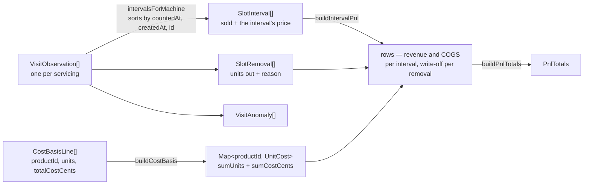
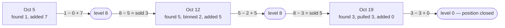
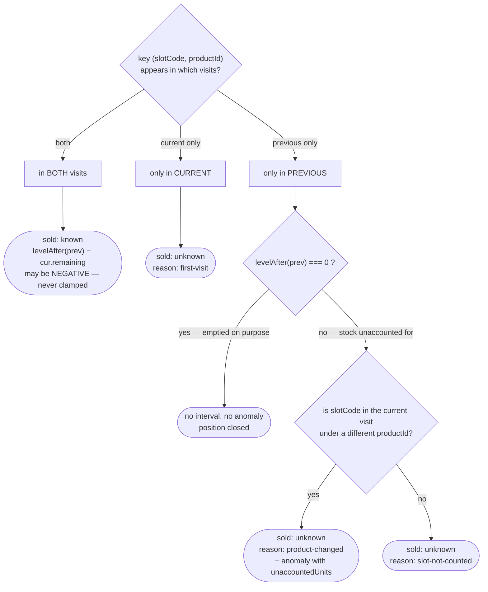
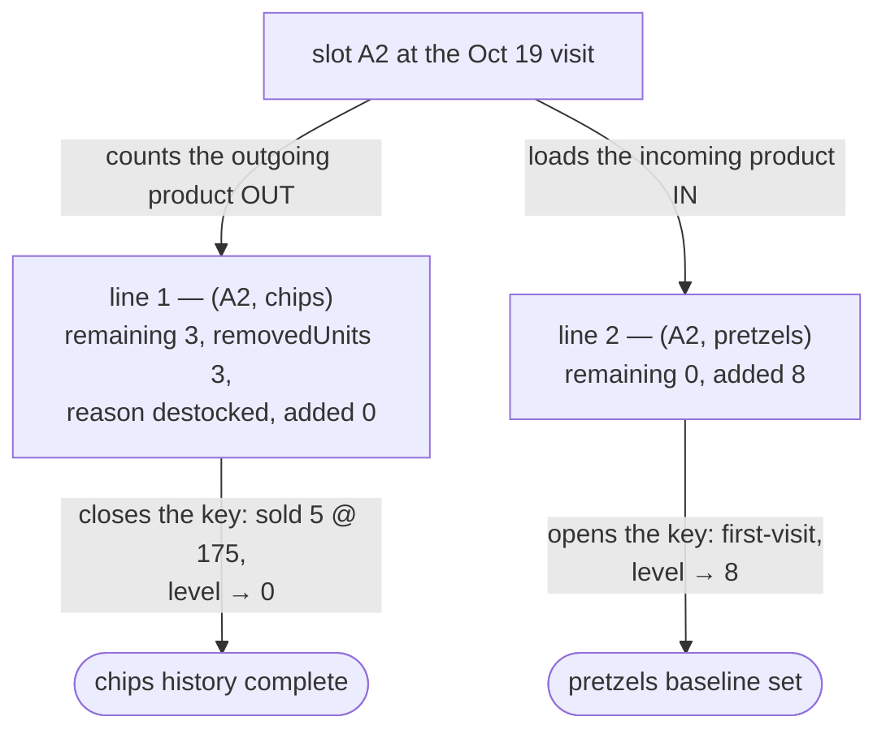

# Visit calculations — worked examples

How a pair of visit counts becomes units sold, revenue, COGS, and profit. One
machine, three visits, real numbers carried all the way through.

> **Status:** this describes the Phase 1 engine in `packages/domain/src/{visits,costs,pnl}`.
> The types are committed; the arithmetic is being built test-first, so treat every
> number below as a case the tests pin rather than as a record of shipped behaviour.
> Design rationale lives in `docs/plans/2026-10-05-visits-and-ios.md`.

## The one rule everything follows

**A visit stores only observations — counts, prices, par, removals. Every derived
number is computed from the ordered visit sequence at read time. Nothing derived is
ever persisted.**

So a Costco receipt entered three weeks late retroactively corrects COGS on every
interval it touches, and a backdated offline visit just changes what the next read
returns. Scenario 1 shows both.

## The pipeline

Two independent input streams — what you counted, and what you paid — meeting only
at the final step.



`buildCostBasis` returns **sums, not unit costs** — that is what lets `cogsForUnits`
divide exactly once, at the end.

## The sold identity

For a given **(slotCode, productId)** key:

```
levelAfter(visit) = visit.remaining − visit.removedUnits + visit.added
sold (prev → cur) = levelAfter(prev) − cur.remaining
```

`remaining` is what was physically in the slot on arrival — **before refilling and
before pulling anything out**. `added` and `removedUnits` belong to the *previous*
visit in the formula: they are things you did at that servicing, and together they
set the level the next interval draws down from.

Every visit therefore does two jobs — its `remaining` closes the interval behind it,
its `levelAfter` opens the one ahead. Slot A2 across all three visits:



## What the engine does with each key

The branch that matters most is the bottom right: **a missing line is never
`remaining = 0`.** Treating it as zero books the whole leftover as sold and invents
revenue.



None of the three `unknown` outcomes yields a sold figure, and none of them is zero.

---

# Scenario 1 — an ordinary week

Machine `m1` at Westside Gym, three slots. Serviced Oct 5 and Oct 12. Cokes sell
normally, two bags of chips go out of date, and the protein bar is a dud you pull.

## What you recorded

```ts
// Oct 5
{ id: "v1", machineId: "m1",
  countedAt: "2026-10-05T17:02:00Z", createdAt: "2026-10-05T17:04:11Z",
  lines: [
    { slotCode: "A1", productId: "coke",  remaining: 2, added: 8, removedUnits: 0, removedReason: null, priceCents: 150, par: 10 },
    { slotCode: "A2", productId: "chips", remaining: 1, added: 7, removedUnits: 0, removedReason: null, priceCents: 175, par: 8  },
    { slotCode: "A3", productId: "bar",   remaining: 4, added: 2, removedUnits: 0, removedReason: null, priceCents: 250, par: 6  },
  ] }

// Oct 12 — counted at 4:48pm in the gym, submitted at 10:10pm from home.
// countedAt is 5 hours before createdAt, and the engine orders by countedAt.
{ id: "v2", machineId: "m1",
  countedAt: "2026-10-12T16:48:00Z", createdAt: "2026-10-12T22:10:03Z",
  lines: [
    { slotCode: "A1", productId: "coke",  remaining: 3, added: 7, removedUnits: 0, removedReason: null,        priceCents: 175, par: 10 },
    { slotCode: "A2", productId: "chips", remaining: 5, added: 5, removedUnits: 2, removedReason: "expired",   priceCents: 175, par: 8  },
    { slotCode: "A3", productId: "bar",   remaining: 4, added: 0, removedUnits: 4, removedReason: "destocked", priceCents: 250, par: 6  },
  ] }
```

Coke went up to $1.75 on Oct 12. Watch where that price does *not* apply.

## Intervals

Levels after Oct 5: A1 `2+8=10`, A2 `1+7=8`, A3 `4+2=6`. Subtract Oct 12's `remaining`:

```ts
[ { slotCode: "A1", productId: "coke",  from: "2026-10-05T17:02:00Z", to: "2026-10-12T16:48:00Z",
    sold: { status: "known", units: 7 }, priceCents: 150, parAtFill: 10 },   // 10 − 3
  { slotCode: "A2", productId: "chips", …, sold: { status: "known", units: 3 }, priceCents: 175, parAtFill: 8 },  // 8 − 5
  { slotCode: "A3", productId: "bar",   …, sold: { status: "known", units: 2 }, priceCents: 250, parAtFill: 6 } ] // 6 − 4
```

**A1 is priced at 150, not 175.** The interval is priced at the *previous* visit's
line — $1.50 is what it sold at all week. The $1.75 applies to the next interval.
This is the easiest bug in the system to write, which is why `SlotInterval` carries
its own price rather than looking one up.

## Removals

```ts
[ { slotCode: "A2", productId: "chips", visitId: "v2", countedAt: "2026-10-12T16:48:00Z", units: 2, reason: "expired"   },
  { slotCode: "A3", productId: "bar",   visitId: "v2", countedAt: "2026-10-12T16:48:00Z", units: 4, reason: "destocked" } ]
```

Returned separately from intervals because **a removal happens at a visit, not during
an interval**. Fold it into the interval and a removal on the machine's last visit is
silently dropped for want of a following interval.

A3's level is now `4 − 4 + 0 = 0`, so that position is closed.

## Cost basis

Your purchase lines, pack expansion already done server-side:

```ts
[ { productId: "coke",  units: 24, totalCostCents: 1199 },   // Oct 1, Costco
  { productId: "chips", units: 12, totalCostCents: 899  },   // Oct 1, Costco
  { productId: "coke",  units: 12, totalCostCents: 699  } ]  // Oct 8, Smart & Final
```

```ts
Map {
  "coke"  => { status: "known", sumUnits: 36, sumCostCents: 1898 },
  "chips" => { status: "known", sumUnits: 12, sumCostCents: 899  },
}
// "bar" is absent — no receipt has ever been logged for it
```

```ts
cogsForUnits(7, coke)       // round(7 × 1898 / 36) = round(369.06) = 369
cogsForUnits(3, chips)      // round(3 × 899  / 12) = round(224.75) = 225
cogsForUnits(2, undefined)  // { status: "unknown", reason: "no-purchases" }  ← NOT 0
```

### Why COGS rounds exactly once

```ts
unitCostCentsForDisplay(coke)  // 53  → "about $0.53 each"
```

`53 × 7 = 371`. The real COGS is **369**. Two cents of drift on one slot in one week,
compounding across every slot and every interval — so the helper is display-only and
must never be multiplied by a count.

## Rows

```ts
intervals: [
  { interval: A1, revenueCents: 1050, cogsCents: 369  },   // 7 × 150
  { interval: A2, revenueCents:  525, cogsCents: 225  },   // 3 × 175
  { interval: A3, revenueCents:  500, cogsCents: null },   // 2 × 250, cost unknown
]
removals: [
  { removal: A2chips, disposition: "written-off", costCents: 150 },   // round(2 × 899/12)
  { removal: A3bar,   disposition: "returned-to-stock" },             // ← no cost field at all
]
```

The bar's **revenue is real** — two sold at $2.50, $5.00 collected. Only its cost is
unknown.

`RemovalPnlRow` is a union discriminated on disposition, so a `returned-to-stock` row
has no `costCents` *key* — not a zero. There is no field to accidentally add to a loss
total. Those 4 bars are still your inventory and their COGS will land wherever they sell.

## Totals

```ts
{ revenueCents:          2075,   // 1050 + 525 + 500 — all real
  cogsCents:             null,   // ANY unknown row ⇒ null, never a partial sum
  grossProfitCents:      null,
  writeOffCents:          150,
  writeOffUnits:            2,
  returnedToStockUnits:     4,   // units only, deliberately no cost
  netProfitCents:        null,
  unknownSoldRows:          0,
  unknownCostRows:          1,
  unknownRemovalReasonRows: 0 }
```

One anomaly: `{ kind: "unknown-cost", productId: "bar" }`.

The screen reads **"Revenue $20.75 · profit unavailable: 1 product lacks purchase
history · 2 units written off"** — not a confidently wrong profit number.

## The late receipt

You find the bar receipt: 12 bars, $14.40. Log it. **Nothing recomputes and nothing
is migrated** — the next read simply includes one more `CostBasisLine`:

```ts
{ revenueCents:     2075,   // unchanged
  cogsCents:         834,   // 369 + 225 + 240
  grossProfitCents: 1241,   // 2075 − 834
  writeOffCents:     150,
  netProfitCents:   1091,   // 1241 − 150
  unknownCostRows:     0 }
```

Same two visit documents, untouched. A receipt entered three weeks late corrected a
week you had already looked at. If any of this were stored, that would mean finding
and rewriting every affected row.

**And the two profit figures earn their keep:** $12.41 gross is how the route
performed; $10.91 net is after the chips you threw away. The $1.50 gap is the number
you would act on, visible instead of buried in COGS.

---

# Scenario 2 — replacing a product

Oct 19. Coke keeps selling. **Chips get replaced with pretzels while there is still
stock in the slot.** A3, already emptied, gets Gatorade.

State carried out of Oct 12:

| key | level after Oct 12 | price then |
|---|---|---|
| `(A1, coke)` | 10 | 175 |
| `(A2, chips)` | 8 | 175 |
| `(A3, bar)` | **0** (destocked) | 250 |

## A replacement is two lines on one slot



Two lines sharing a `slotCode` with different `productId`s is **not a special case** —
it is the identical mechanism to a mixed spiral, and Phase 4 service rule 6 permits it
while still rejecting a duplicate `(slotCode, productId)` pair. The schema needed no
change to support replacement.

## What you recorded

```ts
{ id: "v3", machineId: "m1",
  countedAt: "2026-10-19T16:30:00Z", createdAt: "2026-10-19T16:33:40Z",
  lines: [
    { slotCode: "A1", productId: "coke",     remaining: 4, added: 6, removedUnits: 0, removedReason: null,        priceCents: 175, par: 10 },

    // A2 — the swap
    { slotCode: "A2", productId: "chips",    remaining: 3, added: 0, removedUnits: 3, removedReason: "destocked", priceCents: 175, par: 8  },
    { slotCode: "A2", productId: "pretzels", remaining: 0, added: 8, removedUnits: 0, removedReason: null,        priceCents: 200, par: 8  },

    // A3 — the bar was already at 0, so only the new product needs a line
    { slotCode: "A3", productId: "gatorade", remaining: 0, added: 6, removedUnits: 0, removedReason: null,        priceCents: 225, par: 6  },
  ] }
```

The outgoing line reads: *"I found 3 chips, I took all 3 out because they were not
moving, I added nothing."*

## Intervals and removals

```ts
intervals: [
  { slotCode: "A1", productId: "coke",     sold: { status: "known", units: 6 }, priceCents: 175, parAtFill: 10 },  // 10 − 4
  { slotCode: "A2", productId: "chips",    sold: { status: "known", units: 5 }, priceCents: 175, parAtFill: 8  },  // 8 − 3
  { slotCode: "A2", productId: "pretzels", sold: { status: "unknown", reason: "first-visit" }, priceCents: 200, parAtFill: 8 },
  { slotCode: "A3", productId: "gatorade", sold: { status: "unknown", reason: "first-visit" }, priceCents: 225, parAtFill: 6 },
]

removals: [
  { slotCode: "A2", productId: "chips", visitId: "v3", units: 3, reason: "destocked" },
]
```

**The chips got a real closing number: 5 sold.** Their final week is ordinary revenue,
not a mystery. Each product in the shared slot diffed against its own key without
interfering with the other.

`(A3, bar)` produces **nothing at all** — no interval, no anomaly. Its level was
already 0 and the key stopped appearing, so the position reads as closed on purpose.
The alternative would be emitting `sold: 0` for it on this visit and every visit
after, forever: a row that says nothing. Chips are now at 0 too, so the same thing
happens to them from here on — the replacement closed itself.

## Totals for Oct 12 → Oct 19

```ts
{ revenueCents:         1925,   // coke 6×175 = 1050  +  chips 5×175 = 875
  cogsCents:             691,   // round(6×1898/36)=316  +  round(5×899/12)=375
  grossProfitCents:     1234,
  writeOffCents:           0,   // nothing was binned
  writeOffUnits:           0,
  returnedToStockUnits:    3,   // the 3 chips are in the van, still yours
  netProfitCents:       1234,
  unknownSoldRows:         2,   // pretzels and gatorade, both brand new
  unknownCostRows:         0 }
```

`netProfit === grossProfit` here. **Destocking cost you nothing** — those 3 bags will
sell at another machine and their COGS will land there. Last week two *expired* bags
opened a $1.50 gap between the same two figures. Same mechanism, opposite outcome,
decided entirely by the reason.

The two `first-visit` rows are informational, not a problem. They surface as
`no-baseline` anomalies so a report can say "2 products introduced this period"; if
that proves noisy in practice the UI filters on `kind`, with no engine change.

## The same visit, recorded carelessly

Suppose you just recorded the pretzels and moved on — the natural thing to do if
nothing prompts you. The slot `A2` still exists in the visit, but under a different
product:

```ts
{ kind: "product-changed", slotCode: "A2", productId: "chips", unaccountedUnits: 8 }
```

No sold figure. The engine knows 8 chips were in that slot and knows nothing about
where they went — some sold, some went to the van, and nothing recorded says which.

| | recorded properly | chips line omitted |
|---|---|---|
| revenue | **$19.25** | $10.50 |
| COGS | $6.91 | $3.16 |
| gross profit | **$12.34** | $7.34 |
| `returnedToStockUnits` | 3 | 0 |
| `unknownSoldRows` | 2 | 3 |
| anomalies | 2 × `no-baseline` | + `product-changed`, 8 units |

**$8.75 of revenue and $5.00 of profit never appear**, and 3 units drop out of
inventory tracking, so van stock is wrong too. The report is not *incorrect* — it is
honest about having a hole, which is the design working. But the hole was avoidable.

### The takeaway is a UI one

The engine can only report what it is given, and the entire difference between those
two columns is whether a second line got recorded. So the capture screens must not
depend on the operator remembering.

**"Replacing this product?" should be a first-class action on a cell that emits both
lines** — pre-filling `removedUnits` with the count just entered and defaulting the
reason to `destocked`. One tap produces the left column; leaving it to memory produces
the right one. Phases 5 and 8 own this.

---

# Reference

## Removal reasons

`visits/removals.ts` holds the only mapping from reason to disposition, so the engine
never branches on a reason and adding one later is a table change rather than an
arithmetic change.

| reason | disposition | effect on profit |
|---|---|---|
| `expired` | `written-off` | cost hits `netProfitCents` |
| `damaged` | `written-off` | cost hits `netProfitCents` |
| `recalled` | `written-off` | cost hits `netProfitCents` |
| `destocked` — slow mover pulled back to the van | `returned-to-stock` | **none** |
| `transferred` — moved straight into another machine | `returned-to-stock` | **none** |

A transfer is free, and not by convention: unit cost is an all-time, org-wide weighted
average per product, so the COGS for those units lands wherever they sell. Booking a
cost at removal would double-count.

Van stock therefore falls out for free as a later report, with no new data:
`Σ purchased − Σ added + Σ removed(returned-to-stock)`. A negative result is a
data-entry error worth surfacing.

## Anomalies

Returned as data, never thrown — the same call `normalizeSlots` makes in
`machines/slots.ts`, and for the same reasons: the visit already happened, one odd
slot should not blank the other 29, and this package cannot reach the api package's
`ServiceError` (a plain `Error` would surface as a 500 instead of a 400).

**Here is why there is no number:**

| anomaly | what happened | what you would do |
|---|---|---|
| `no-baseline` | no predecessor to diff against | nothing — normal for a new product |
| `slot-not-counted` | the slot was missing from the later visit | count it next time |
| `product-changed` | slot changed product without the old one counted out | record `removedUnits` next time |
| `unknown-cost` | no purchase history for the product | enter the receipt |
| `unknown-removal-reason` | units removed, no reason recorded | should be impossible — the API requires one |

**Here is a number that looks wrong** — the figure *is* computed and returned:

| anomaly | what happened | what you would do |
|---|---|---|
| `negative-sold` | sold came out below zero | check for stock added outside a visit, or a miscount |
| `over-par` | filled past par | usually nothing — you crammed an extra bag in |
| `over-removed` | removed more than you found | a typo; fix the next count |

The engine **never clamps**. A −2 is reported as −2, because a −2 followed by a +14
still sums to the true 12; clamping to zero would permanently overstate.

Deliberately *not* an anomaly: **an out-of-order visit.** A 9am count landing after a
2pm one is normal with offline capture, and the arithmetic is unaffected because the
engine sorts by `countedAt`. It is logged at the service layer as an insertion event,
because it is about when a document arrived rather than about what the numbers say.
