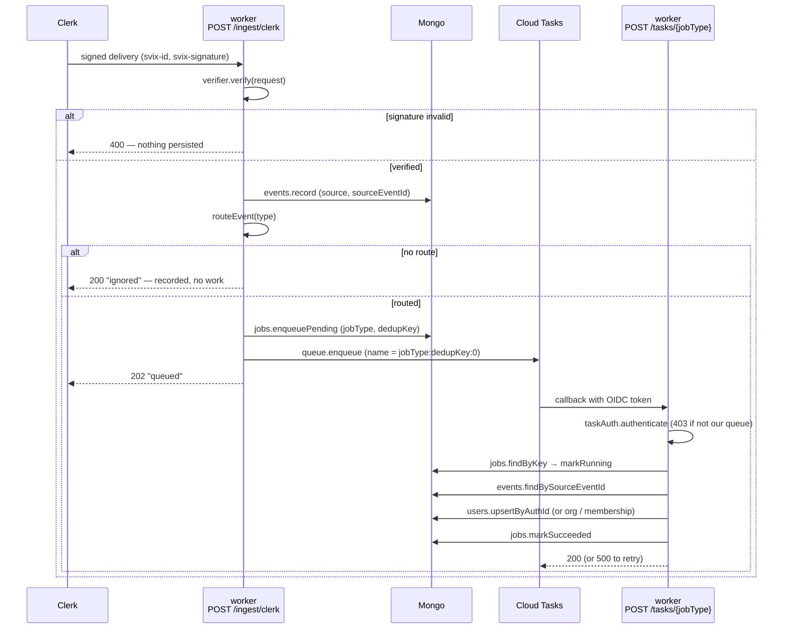
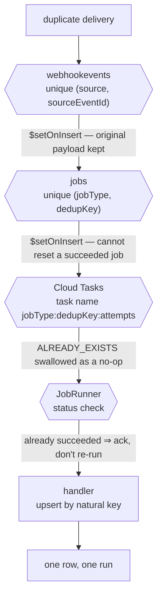

# Clerk webhook ingestion

How a Clerk event becomes a local `users` / `organizations` /
`organizationmemberships` row. Lives in `packages/worker`, the second Cloud Run
service — see `packages/worker/README.md`.

## The two hops

Ingestion and execution are separate HTTP requests on purpose. The first must
answer Clerk promptly; the second gets Cloud Tasks' retry policy for free.

The job row is written **before** the task is enqueued. That ordering is
deliberate: the safe failure mode is "row exists but no task" — visible in
`jobs` and retryable — rather than a task arriving with no row to record into.

## Why a redelivery is harmless

Providers retry on any non-2xx, so the same event *will* arrive twice. Four
independent layers absorb it, and the handlers are idempotent on top of all
four because the queue only promises at-least-once.

Nothing in the ingest path short-circuits on `alreadySeen`. Re-running
record / enqueuePending / enqueue is what makes a crash mid-flow self-healing:
each step converges, so a redelivery repairs a half-finished one.

## Status is the retry contract

Cloud Tasks retries any non-2xx, so `JobRunner`'s return code *is* the policy.

| Outcome | Code | Why |
|---|---|---|
| handler returned | 200 | done |
| malformed task body | 200 | nothing addressable — no retry can find the job |
| no job row | 200 | the row is written first, so its absence is permanent |
| already `succeeded` | 200 | backstop for a lapsed task-name dedup window |
| unknown job type | 200 | this deploy has no handler; recorded as failed |
| `PoisonJobError` | 200 | cannot ever succeed; burning attempts only hides it |
| any other throw | 500 | assumed transient — retry per queue policy |

## Why the guards live in the app

The worker is deployed `--allow-unauthenticated` because Clerk's sender has no
Google credential. Cloud Run IAM gates a whole service rather than a path, so it
cannot protect `/tasks/*` while leaving `/ingest/clerk` open. Both guards are
therefore in-process: the svix signature on ingestion, and an OIDC token check
(audience = `WORKER_URL`, issuer = the invoker service account) on callbacks.
